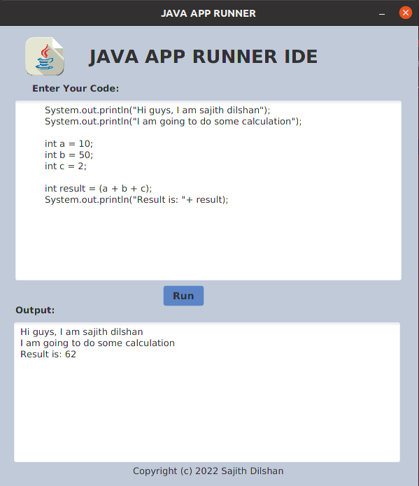

#JAVA-APP-RUNNER-IDE

####This application is a JavaFx Application.we can run java code without template code.I am recommend that IDE for java beginner to learn java without template code. 

### How to use this repo?

1. Clone the repository first  'git clone'

2. Once cloned,you can open the repository from any prefered IDE

3. Build and Run!

### Prerequisites
1.Use JDK 1.8

### License

Version 1.0 , 2022

Copyright © copy; 2022 [Sajith dilshan](https://www.linkedin.com/in/sajith-dilshan/). All rights reserved.

Licensed under the [MIT](LICENSE.txt) license